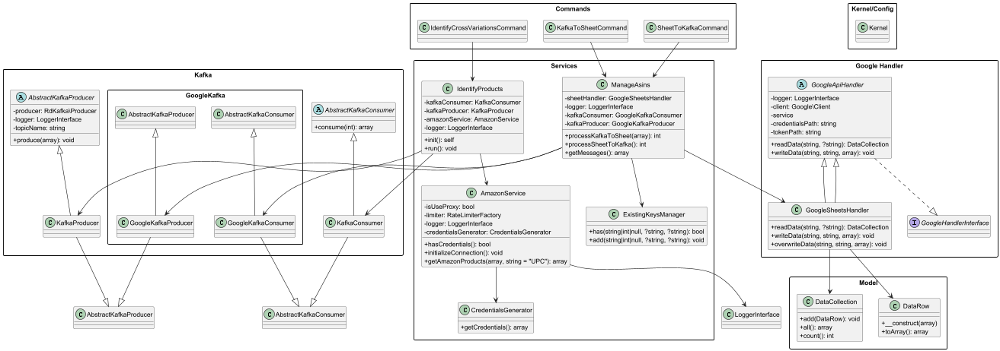

# Amazon ASIN Product Sync

> **Идентификатор и синхронизатор ASIN по UPC/EAN/GTIN через Amazon SP-API, Google Sheets и Kafka**

[](https://github.com/sni10/amazon_asin_product_sync/releases)
[](https://github.com/sni10/amazon_asin_product_sync/actions/workflows/release.yml)
[](https://github.com/sni10/amazon_asin_product_sync/actions/workflows/tests.yml)
[](https://github.com/sni10/amazon_asin_product_sync/actions/workflows/tests.yml)
[](https://www.php.net/)
[](https://symfony.com/)
[](https://www.docker.com/)
[](LICENSE)

## Environments

Проект поддерживает два окружения, управляемых через Docker Compose:

### Production environment
- Использует `docker-compose.yml` как базовую конфигурацию
- Настроено для боевого развёртывания с оптимизированными параметрами
- Переменные окружения: `APP_ENV=prod`, `APP_DEBUG=false`

### Development / Testing environment
- Использует `docker-compose.yml` + `docker/config-envs/test/docker-compose.override.yml`
- Включает отладку, покрытие кода и подробные сообщения об ошибках
- Переменные окружения: `APP_ENV=test`, `APP_DEBUG=true`
- Xdebug включён для покрытия и отладки

## Running the Application

### Production
1. Клонируйте репозиторий:
```bash
git clone https://github.com/sni10/amazon_asin_product_sync.git
cd amazon_asin_product_sync
```

2. Создайте файл `.env.prod` на основе `.env.example` с боевыми настройками

3. Соберите и запустите контейнеры:
```bash
docker compose build
docker compose up -d
```

### Development / Testing
1. Создайте `.env.test` на основе `.env.example` с параметрами для test/dev

2. Соберите и поднимите окружение с тестовым override:
```bash
docker compose --env-file .env.test -f docker-compose.yml -f docker/config-envs/test/docker-compose.override.yml build

docker compose --env-file .env.test -f docker-compose.yml -f docker/config-envs/test/docker-compose.override.yml up -d
```

## Makefile

Для удобства доступны make-команды. По умолчанию `APP_ENV=test`.

```bash
make init                 # Полная инициализация (build + up + composer)
make up / make down       # Запуск / остановка контейнеров
make test                 # Запуск тестов
make test-coverage        # Тесты с покрытием
make shell                # Bash в PHP-контейнере
make help                 # Список всех команд
```

Основные группы: `build`, `up`, `down`, `restart`, `logs`, `ps`, `shell` (Docker), `test-*` (тесты), `console`, `composer-*`.

Production: `make prod-build`, `make prod-up`, `make prod-down`.

## Application composition (Services)
```
NAME                       IMAGE                    SERVICE   STATUS
amazon_asin_product_sync   amazon-asin-sync-php     php       Up
```

При старте контейнера `supervisord` автоматически запускает консольные команды:
```bash
app:id-cross-var         # Идентификация кросс-вариаций
app:asin-sheet-to-kafka  # Синхронизация Google Sheets → Kafka
app:asin-kafka-to-sheet  # Синхронизация Kafka → Google Sheets
```

## Архитектура

- **Model** — структуры данных (DataRow, DataCollection) без бизнес-логики
- **Service** — оркестрация бизнес-процессов (AmazonService, ManageAsins, IdentifyProducts)
- **Handler** — реализация паттерна Strategy для работы с источниками (GoogleSheetsHandler, GoogleApiHandler)
- **Kafka** — продюсеры и консьюмеры для обмена сообщениями
- **Command** — входные точки Symfony Console



## Конфигурация

### Переменные окружения

Переменные окружения берутся из `.env.prod` / `.env.test`:

- `KAFKA_*` — настройки подключения к Kafka
- `GOOGLE_*` — ключи OAuth/Service Account
- `APP_ENV` / `APP_DEBUG` / `APP_SECRET` — настройки Symfony

### Внешние API

- **Google Sheets/Drive**: `docker/configs-data/credentials.json`, `docker/configs-data/token.json`
- **Amazon SP-API**: `config/amazon_credentials.json`, `config/amazon_proxy.json`

---

## Tests

Проект включает покрытие тестами на базе PHPUnit:
- **Unit-тесты** (`tests/Unit/`) — быстрые изолированные тесты для моделей и бизнес-логики
- **Feature-тесты** (`tests/Feature/`) — интеграционные тесты

### Running tests locally

Тесты запускаются внутри контейнера PHP, используя окружение разработки/тестирования.

1. Поднимите тестовое окружение:
```bash
docker compose --env-file .env.test -f docker-compose.yml -f docker/config-envs/test/docker-compose.override.yml up -d
```

2. Запустите все тесты:
```bash
docker compose --env-file .env.test exec php vendor/bin/phpunit --colors=always --testdox
```

3. Запустите тесты с покрытием:
```bash
docker compose --env-file .env.test exec php vendor/bin/phpunit --coverage-text --colors=always --testdox
```

4. Сгенерируйте HTML-отчёт покрытия:
```bash
docker compose --env-file .env.test exec php vendor/bin/phpunit --coverage-html=var/coverage-report
```

### Running individual tests

Запустить один файл тестов:
```bash
docker compose --env-file .env.test exec php vendor/bin/phpunit tests/Unit/Model/DataRowTest.php
```

Запустить конкретный тестовый метод:
```bash
docker compose --env-file .env.test exec php vendor/bin/phpunit --filter=testConstructorWithData
```

Запустить только Unit-тесты:
```bash
docker compose --env-file .env.test exec php vendor/bin/phpunit tests/Unit/
```

### CI/CD testing

Тесты автоматически запускаются в GitHub Actions при создании pull request в ветку `dev`. В пайплайне выполняется:
1. Сборка Docker-контейнеров с тестовой конфигурацией
2. Запуск всех тестов с покрытием
3. Загрузка отчётов покрытия как артефактов

Полную конфигурацию CI/CD смотрите в `.github/workflows/tests.yml`.

---

## Отладка

Для отладки использовать удалённый интерпретатор из Docker-контейнера. Конфигурация Xdebug:

```ini
xdebug.mode=debug
xdebug.start_with_request=yes
xdebug.client_host=host.docker.internal
xdebug.client_port=9003
xdebug.idekey=PHPSTORM
```

---

## Git Workflow and Releases

### Branching Strategy
- `main` — production-ready code
- `stage` — Staging (pre-production)
- `dev` — интеграционная ветка разработки

### Release Process
1. Фичи разрабатываются в feature-ветках и вливаются в `dev` через pull request
2. Тесты автоматически запускаются на каждый PR в `dev` (см. `.github/workflows/tests.yml`)
3. Когда `dev` стабилен, создайте PR из `dev` → `stage`
4. После валидации `stage` создайте PR из `stage` → `main`
5. После мержа PR `stage` → `main` автоматически создаётся новый релиз с инкрементом версии (см. `.github/workflows/release.yml`)

### Automated Release Creation
- Триггерится при мерже PR из `stage` в `main`
- Автоматически увеличивается patch-версия (например, v1.0.0 → v1.0.1)
- Создаётся релиз GitHub с changelog
- Теги в формате семантического версионирования: `vMAJOR.MINOR.PATCH`

---

## Documentation

- [Development Guidelines](.junie/guidelines.md) — инженерные стандарты и правила разработки

---

## License
Proprietary License — see [LICENSE](LICENSE) for details
